# Уровень контейнеров: из чего состоит ПДР

Что внутри ящика с прошлой диаграммы ([c4-context.md](c4-context.md)):
процессы, база, клиент и чужие системы, с которыми они говорят.

**Эта диаграмма не врёт про готовность.** У каждой стрелки стоит состояние —
`есть` или `план`, — и оно проверяется машиной: `scripts/check_diagrams.py`
сверяет стрелки с таблицей ниже и требует у каждой `есть` ссылку на файл,
который в дереве действительно лежит. Диаграмма, на которой всё выглядит
готовым, хуже отсутствующей: по ней принимают решения.

Сегодня «есть» ровно две стрелки, и обе — инструментальные. **Ни одного сервиса
в дереве нет:** каталог `services/` не создан, границы контекстов живут
библиотеками в `libs/`, а процессы появятся по одному вместе со своей фазой
([context-map.md](context-map.md)).

```mermaid
flowchart TB
    classDef exists fill:#0F6F7E,stroke:#0F6F7E,color:#ffffff;
    classDef planned fill:#ffffff,stroke:#8a8a8a,stroke-dasharray:4 3,color:#1a1a1a;
    classDef external fill:#f2f2f2,stroke:#8a8a8a,color:#1a1a1a;

    tools["Инструменты разработчика<br/>make, migrate.py, psql"]
    postgres[("PostgreSQL<br/>единственное хранилище,<br/>очереди и вектора тоже здесь")]
    mlstub["Заглушка инференса<br/>deploy/docker-compose.yml"]

    web["Веб-клиент<br/>TypeScript, React, Vite"]
    main["services/main<br/>identity, scheduling, billing, notifications"]
    classroom["services/classroom<br/>video, content, notes"]
    learning["services/learning<br/>exercises, practice, media"]
    insight["services/insight<br/>progress, recommend"]
    market["services/market<br/>profile, matching, reputation"]
    inference["services/inference<br/>ml"]

    livekit["LiveKit<br/>самохостится"]
    payments["ЮKassa"]
    receipts["Чеки самозанятого"]
    models["Провайдер LLM<br/>и эмбеддингов"]

    tools -->|"psql · миграции, выгрузка аккаунта · есть"| postgres
    tools -->|"docker compose · поднимает заглушку · есть"| mlstub

    web -->|"HTTPS JSON · запись, отмена, оплата пакета · план"| main
    web -->|"HTTPS JSON · конспект, материалы, план занятий · план"| classroom
    web -->|"HTTPS JSON · поиск репетитора, профиль, отзывы · план"| market
    web -->|"WebRTC · медиапоток по токену, мимо нас · план"| livekit

    main -->|"Postgres · свои таблицы под RLS · план"| postgres
    main -->|"HTTPS · создание платежа, данные карты мимо нас · план"| payments
    payments -->|"HTTPS-уведомление · оплата прошла, идемпотентно · план"| main
    main -->|"HTTPS · данные расчёта для чека репетитора · план"| receipts

    classroom -->|"Postgres · конспекты, материалы, задание на инференс · план"| postgres
    classroom -->|"HTTPS · выдаёт токен комнаты, комнатой не владеет · план"| livekit

    learning -->|"Postgres · задания, попытки, записи занятий · план"| postgres
    insight -->|"Postgres · прогресс и подбор, вектора через pgvector · план"| postgres
    market -->|"Postgres · профили, репутация, выдача подбора · план"| postgres

    inference -->|"Postgres · забирает задание SKIP LOCKED, кладёт результат · план"| postgres
    inference -->|"HTTPS · только если внешняя модель включена конфигом · план"| models

    class tools,postgres,mlstub exists;
    class web,main,classroom,learning,insight,market,inference planned;
    class livekit,payments,receipts,models external;
```

## Стрелки

Одна строка на стрелку. `есть` обязано ссылаться на файл в дереве, `план` —
называть область задачи, которая стрелку заведёт.

| Стрелка | Протокол | Что передаётся | Состояние | Чем подтверждается |
| --- | --- | --- | --- | --- |
| tools → postgres | psql | миграции, выгрузка аккаунта, выгрузка потока событий | есть | `scripts/migrate.py`, `db/account/export.sql` |
| tools → mlstub | docker compose | поднятие заглушки инференса | есть | `deploy/docker-compose.yml` |
| web → main | HTTPS JSON | запись на занятие, отмена, оплата пакета; `Idempotency-Key` на мутациях | план | области `WEB`, `API` |
| web → classroom | HTTPS JSON | конспект занятия, материалы, программа занятий | план | области `WEB`, `NOTES` |
| web → market | HTTPS JSON | поиск репетитора, профиль, отзывы | план | области `WEB`, `MATCH` |
| web → livekit | WebRTC | медиапоток между людьми и комнатой, через бэкенд не идёт | план | область `VIDEO` |
| main → postgres | Postgres | таблицы `identity`, `scheduling`, `billing`, очередь оповещений | план | область `SCHED`, [долги первого сервиса](first-service.md) |
| main → payments | HTTPS | создание платежа в пользу репетитора; данные карты мимо нас | план | область `BILL` |
| payments → main | HTTPS-уведомление | «оплата прошла»; обработка идемпотентна по ключу платежа | план | область `BILL` |
| main → receipts | HTTPS | данные расчёта для чека самозанятого, состояние чека | план | область `BILL` |
| classroom → postgres | Postgres | конспекты, материалы, задание на инференс в очередь | план | области `NOTES`, `MEDIA` |
| classroom → livekit | HTTPS | выдача токена комнаты на время занятия | план | область `VIDEO` |
| learning → postgres | Postgres | банк заданий, попытки, записи занятий | план | области `CNT`, `PRACT` |
| insight → postgres | Postgres | прогресс и подбор; поиск похожего через `pgvector` | план | области `PRG`, `RECO` |
| market → postgres | Postgres | профили, репутация, выдача подбора | план | области `PROF`, `MATCH`, `REP` |
| inference → postgres | Postgres | забирает задание через `SKIP LOCKED`, кладёт результат | план | область `ML` |
| inference → models | HTTPS | текст на суммаризацию или эмбеддинг — только при включённой внешней | план | `configs/dynamic/registry.yaml`, `PDR_AI_NODES` |

## Имена из задачи и контейнеры на карте

В разговоре сервисы называют по подсистеме, а в дереве они группируются по
фазам и общим транзакциям ([context-map.md](context-map.md), раздел
«Группировка в процессы»). Соответствие:

| Как называют | Какой контейнер | Почему так |
| --- | --- | --- |
| scheduling-service | `services/main` | расписание делит транзакцию с правами, оплатой и оповещением: запись на занятие в одном коммите проверяет опеку, занимает слот и списывает занятие из пакета |
| billing-service | `services/main`, выделяется по триггеру | триггер наблюдаемый: очередь вебхуков начинает мешать записи |
| notes-service | `services/classroom` | конспект пишется по ходу занятия и ссылается на материалы — одна транзакция репетитора |
| task-recommender | `services/insight` | подбор задач опирается на прогресс, а прогресс считается там же |
| tutor-matching-service | `services/market` | подбор репетитора неотделим от профиля и репутации |

Отдельного процесса на подсистему не заводится «на всякий случай»: у каждого
выделения записан наблюдаемый триггер, и до срабатывания триггера лишний
процесс — это лишняя выкатка и лишний пул соединений.

## Чего на диаграмме нет намеренно

* **Отдельного воркера фоновых заданий.** Механизм одиночных заданий живёт
  внутри того процесса, чьё задание крутит ([jobs.md](jobs.md)); второго
  процесса с теми же таблицами не будет;
* **очереди как отдельного контейнера.** Очередь — это таблица в PostgreSQL и
  `SKIP LOCKED`, а не брокер ([ADR-0002](../adr/0002-postgres-only-storage.md));
* **кэша как отдельного контейнера.** Кэш штатный, внутри процесса
  ([ADR-0013](../adr/0013-standard-over-handmade.md));
* **`services/chat` и `services/analytics`.** Они есть на карте контекстов, но
  на этой диаграмме их нет: рисовать пятую и шестую фазу рядом с первой значит
  делать картинку нечитаемой ради полноты, которой всё равно никто не
  воспользуется.
