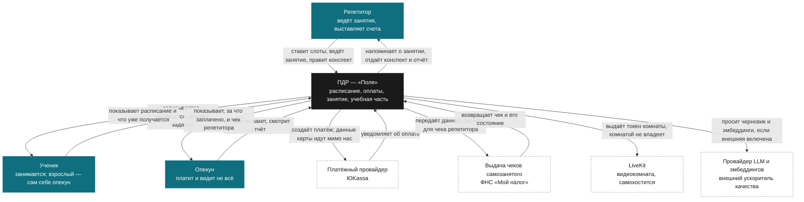

# Уровень контекста: кто с кем и зачем

Самый внешний взгляд: ПДР как один ящик, вокруг — люди и чужие системы. Что
внутри ящика — [c4-container.md](c4-container.md).

Ничего из внешних систем в дереве пока нет: ни одной интеграции, ни одного
адаптера — [openness.md](openness.md). Эта диаграмма про **замысел связей**, и
именно поэтому у неё нет пометок «есть / план»: помечать нечего, всё справа и
слева от ящика — люди и будущее. Готовность помечена на уровне контейнеров, где
ей есть чем противоречить.

## Что на этой картинке важнее связей

**Опекуна может не быть вовсе.** Взрослый самостоятельный ученик — не частный
случай схемы «ученик и родитель», а отдельный путь через всю систему
([ADR-0006](../adr/0006-parental-access-by-design.md)). Стрелки опекуна на
диаграмме есть, но обязательными они не являются ни в одном сценарии.

**Деньги идут мимо нас.** Стрелка к платёжному провайдеру — «создаёт платёж», а
не «принимает деньги»: плательщик рассчитывается с репетитором, мы не сторона
расчётов ([ADR-0008](../adr/0008-tutor-is-the-seller.md),
[ADR-0017](../adr/0017-a-layer-in-help-not-a-seller.md)). Данные карты не
проходят через бэкенд даже транзитом — поэтому от плательщика к провайдеру
стрелки через ПДР нет и не будет.

**Чек выбивает репетитор, а не платформа.** Мы передаём данные расчёта и храним
состояние чека. «Оплата прошла, чек не сформирован» — состояние, а не сбой.

**Комнатой мы не владеем.** К LiveKit идёт одна стрелка — выдача токена;
медиапоток между людьми и комнатой нас не касается и на этой диаграмме
намеренно не нарисован: он не проходит через ПДР.

**Стрелки к провайдеру моделей может не быть.** У каждого ИИ-узла есть своя
реализация, работающая без единого внешнего вызова
([ADR-0015](../adr/0015-own-model-for-every-ai-node.md)); внешний провайдер
включается динамическим конфигом и выключается им же.

## Кого здесь нет

* **школы как отдельного действующего лица** — школа это арендатор, то есть
  несколько репетиторов и учеников внутри одной границы, а не новая роль;
* **администратора платформы** — его работа не является частью продукта: у нас
  нет модерации, арбитража и ручного вмешательства в чужие занятия;
* **календарей** — обмен идёт файлом стандарта iCalendar, внешней системы там
  нет вовсе ([openness.md](openness.md)).
