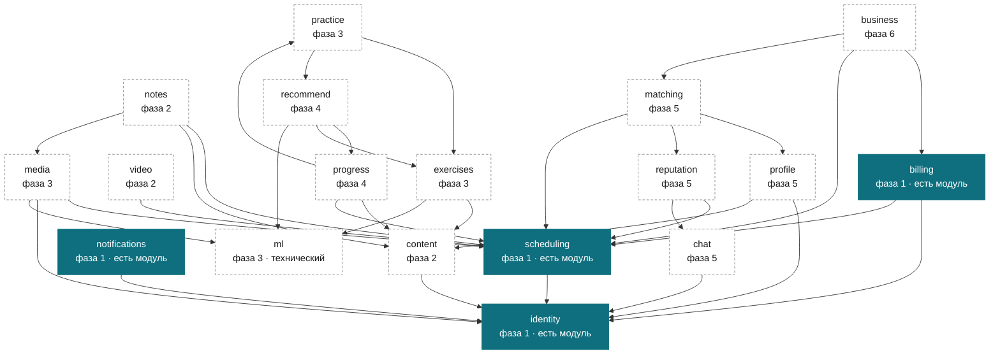

# Карта контекстов

**Карта контекстов и карта развёртывания — разные карты.**

Контексты фиксируются здесь и сейчас и дальше не двигаются: граница между
«расписанием» и «оплатами» не зависит от того, сколько у нас процессов. Число
процессов, наоборот, растёт постепенно — сервис рождается вместе со своей
фазой, а не все восемнадцать в первый день.

Разница между хорошим монолитом и распределённым монолитом ровно одна: у
модуля есть граница или её нет. Модуль, у которого граница проверяется
сборкой, вынимается в отдельный сервис механически — берётся код, берётся его
таблица, ставится сетевой вызов вместо прямого. Модуль, у которого границы
нет, не вынимается никогда: попытка кончается двумя процессами, которые ходят
в одну базу, и это хуже, чем один процесс.

Здесь только карта и правила. Модули, проверка границ сборкой и реестр
событий — задача `PDR-ARCH-07`.

## Правило владения — без исключений

**У каждой таблицы ровно один контекст-владелец. Только он в неё пишет и
только он в неё ходит напрямую.**

Чужой контекст не читает чужую таблицу — ни `SELECT`, ни через «общий
репозиторий», ни джойном «мне только посмотреть». Данные другого контекста
берутся двумя способами и никакими больше:

* **опубликованный контракт** — синхронный вызов через порт: сегодня прямой
  вызов внутри процесса, завтра сетевой, для вызывающего это одна строка;
* **событие** — асинхронно, когда ответ не нужен немедленно.

Одна общая база при этом остаётся: PostgreSQL у нас единственное хранилище.
Разделяет не сервер базы, а владение таблицами и RLS. Джойн через границу
контекста — это и есть тот единственный способ получить распределённый
монолит, который хуже обычного: связь появляется, а увидеть её нельзя ни в
одном интерфейсе.

Имя таблицы начинается с имени владельца: `scheduling_lesson`,
`billing_invoice`. Владелец виден в имени, и чужое обращение заметно в
код-ревью раньше, чем в проверке.

Правила проекта действуют поверх: у каждой доменной таблицы есть `tenant_id` и
RLS, время хранится как `timestamptz` в UTC плюс отдельная колонка зоны IANA,
деньги — целыми минорными единицами и кодом валюты.

## Как читать карту

**Фаза** — это порядок, а не срок. Дат в проекте нет и в этом документе их
тоже нет. Фаза рождения — когда контекст появляется, а не когда он закончен:
`content` рождается вместе с занятием и продолжает расти всю дорогу.

| Фаза | О чём она |
| --- | --- |
| 0 | каркас: слои, типы платформы, эта карта. Контекстов не рождается |
| 1 | занятие назначено и оплачено |
| 2 | занятие проходит в системе |
| 3 | учебная часть: задания, попытки, запись занятия |
| 4 | смыслы: прогресс и подбор с объяснением |
| 5 | люди находят друг друга |
| 6 | репетитор считает деньги |

Порядок фаз повторяет направления из [ROADMAP](../ROADMAP.md) — там же
написано, чего мы не делаем и почему.

## Диаграмма

Сплошной контур — код есть в дереве. Пунктир — контекст только на карте.
Стрелка — «читает у» (контрактом или событием); пишет в свои таблицы каждый
сам. Показаны главные связи — полный список у каждого контекста ниже.

Сплошным помечены четыре контекста первой фазы: у них есть модуль в `libs/`
со своей целью сборки, своими слоями и своими тестами (`PDR-ARCH-07`).
Остальные существуют только здесь, на карте, и модуля у них нет намеренно:
модуль под контекст, который родится через три фазы, — это мусор, который
придётся поддерживать.

«Есть модуль» не значит «готов»: у identity это опека и её отзыв, у scheduling
— запись занятия в слот, у billing — переехавший сюда срез с тарифом и ценой
пакета, у notifications — превращение доменных событий в строки исходящей
очереди. Остальное владение из списков ниже — план, а не код.

Как завести следующий — [new-context.md](new-context.md).

Синхронные зависимости (контракты) образуют направленный ациклический граф:
цикл в них означал бы, что два контекста нельзя ни собрать по отдельности, ни
разнести по процессам. Событийные связи циклов не создают вообще — подписчик
не знает издателя, между ними реестр событий (`PDR-ARCH-07`). Поэтому
`practice` спрашивает `recommend` контрактом, а `progress` узнаёт о попытках
событием, и обратного ребра не появляется.

## Контексты

Восемнадцать: семнадцать доменных и один технический — `ml`. Он ничего не
решает про предметную область и не владеет доменными данными, но границу имеет
такую же, поэтому стоит на карте на общих правах.

### identity — люди, роли, тенанты, опека, согласия, дееспособность

**Рождается:** фаза 1. Корень: без него некому принадлежать ничему.

**Владеет:**

* `identity_tenant` — арендатор: репетитор-одиночка или школа;
* `identity_person` — человек и его контакты: репетитор, ученик, опекун,
  самостоятельный взрослый ученик;
* `identity_role_assignment` — роль человека в тенанте;
* `identity_guardianship` — связь опекуна с учеником, её выдача и отзыв;
* `identity_consent` — согласия: на обработку данных, на запись занятия;
* `identity_access_log` — кто и когда смотрел запись, транскрипт или переписку;
  право смотреть — не то же самое, что право смотреть незаметно
  ([ADR-0006](../adr/0006-parental-access-by-design.md));
* `identity_capacity` — дееспособность: у взрослого самостоятельного ученика
  опекуна нет вовсе, и это не отсутствующая связь, а отдельное состояние;
* `identity_credential` — способ входа.

**Читает:** ничего.

**Не владеет:** push-токен устройства — у `notifications`; профиль репетитора,
квалификация и верификация — у `profile`. Здесь человек, там витрина.

### scheduling — доступность, занятия, серии, отмены, окна бронирования

**Рождается:** фаза 1.

**Владеет:**

* `scheduling_availability` — когда репетитор готов работать;
* `scheduling_slot` — выставленный слот, единица учёта: к нему привязаны
  оплата, отмена и напоминание;
* `scheduling_lesson` — занятие в слоте;
* `scheduling_series` — серия занятий и правило её повторения;
* `scheduling_cancellation` — отмена, её время и причина;
* `scheduling_booking_window` — окна: за сколько можно записаться и до какого
  момента отменить.

**Читает:** `identity` — кто репетитор, кто ученик, есть ли опекун (контракт);
`billing` — оплачен ли пакет (событие).

### video — комнаты, токены доступа, состояние подключения

**Рождается:** фаза 2.

**Владеет:**

* `video_room` — комната занятия у внешнего провайдера;
* `video_access_token` — выданный короткоживущий токен;
* `video_connection_state` — кто подключён и с каким качеством.

**Читает:** `scheduling` — какое занятие и кто его участники (контракт);
`identity` — роли (контракт).

**Не владеет:** сама запись занятия — у `media`. Провайдер видео живёт за
портом и имеет две реализации: настоящую и заглушку.

### billing — счета, платежи, пакеты, автоплатежи, чеки

**Рождается:** фаза 1.

**Владеет:**

* `billing_tariff` — цена занятия у репетитора;
* `billing_package` — пакет занятий и его остаток;
* `billing_invoice` — счёт;
* `billing_payment` — платёж через ЮKassa: идентификатор платежа у провайдера
  и его состояние. Данных карты здесь нет и быть не может — они не проходят
  через бэкенд даже транзитом;
* `billing_autopayment` — согласие на автоплатёж: токен провайдера, не карта;
* `billing_receipt` — чек самозанятого, обязательный на российском рынке.

**Читает:** `identity` — кто платит, кому выставлять счёт при наличии опекуна
(контракт); `scheduling` — занятие состоялось, списать из пакета (событие).

### content — граф умений, материалы, программы, планы, презентации

**Рождается:** фаза 2, растёт всю дорогу.

**Владеет:**

* `content_skill` — узел графа умений;
* `content_skill_edge` — ребро: что чему предшествует;
* `content_material` — методический материал;
* `content_program` — типовая программа;
* `content_plan` — учебный план конкретного ученика;
* `content_presentation` — презентация к занятию.

**Читает:** `identity` — автор материала (контракт).

**Не владеет:** банк заданий — у `exercises`. Умение описывает, чему учим;
задание — чем проверяем.

### exercises — банк заданий, версии, эмбеддинги

**Рождается:** фаза 3.

**Владеет:**

* `exercises_item` — задание;
* `exercises_version` — версия условия: правка условия — новая версия, иначе
  попытки прошлой недели перестают что-либо значить;
* `exercises_embedding` — вектор задания (`pgvector`) для поиска похожих.

**Читает:** `content` — умения, к которым привязано задание (контракт); `ml` —
считает вектор задания (контракт).

**Важно:** вектор считает `ml`, а хранит `exercises`. Посчитанное значение —
часть задания, а не имущество модели: перезапустится другая версия модели —
вектор пересчитается, но жить он всё равно будет здесь.

### media — записи занятий, транскрипты

**Рождается:** фаза 3.

**Владеет:**

* `media_recording` — метаданные записи; сам файл лежит во внешнем хранилище
  за портом;
* `media_transcript` — транскрипт записи;
* `media_transcript_segment` — сегмент с таймкодом и говорящим.

**Читает:** `scheduling` — какое занятие (контракт); `identity` — есть ли
согласие на запись (контракт, `identity_consent`); `video` — была ли комната
(событие); `ml` — распознавание речи (контракт).

### notes — конспекты, домашние задания

**Рождается:** фаза 2.

**Владеет:**

* `notes_lesson_note` — конспект урока;
* `notes_homework` — домашнее задание, сформулированное репетитором;
* `notes_homework_submission` — сдача такого задания.

**Читает:** `scheduling` — занятие (контракт); `content` — материалы
(контракт); `media` — транскрипт, из которого собирается черновик конспекта
(событие); `exercises` — если задание из банка (контракт).

**Не владеет:** попытки по заданиям из банка — у `practice`. Здесь свободная
формулировка репетитора, там проверяемое задание.

### progress — модель владения, аналитика, уровни видимости

**Рождается:** фаза 4.

**Владеет:**

* `progress_mastery` — оценка владения умением, посчитанная кодом
  детерминированно;
* `progress_snapshot` — срез для аналитики;
* `progress_visibility` — что видит ученик, что опекун, что репетитор.

**Читает:** `practice` — попытки (событие); `notes` — сданные домашние
(событие); `content` — граф умений (контракт); `scheduling` — посещаемость
(событие); `identity` — роли для видимости (контракт).

**Правило:** число здесь считает код и только код. Модель может объяснить
число словами, подменить его она не может.

### practice — выдача заданий, попытки, проверка решений

**Рождается:** фаза 3.

**Владеет:**

* `practice_assignment` — выданное ученику задание;
* `practice_attempt` — попытка;
* `practice_check` — результат детерминированной проверки.

**Читает:** `exercises` — задание и его версия (контракт); `content` — умения
(контракт); `recommend` — что предложить дальше (контракт, с фазы 4; до неё
выдача идёт простым правилом внутри `practice`).

### recommend — подбор заданий, диагностика, объяснение выбора

**Рождается:** фаза 4.

**Владеет:**

* `recommend_request` — запрос на подбор и факты, на которых он строился;
* `recommend_result` — что предложено, в каком порядке и почему;
* `recommend_diagnostic` — диагностический набор.

**Читает:** `progress` — модель владения (контракт); `exercises` — банк и
векторы (контракт); `content` — граф умений (контракт); `practice` — история
попыток (событие); `ml` — формулировка объяснения (контракт).

**Правило:** факты считаем детерминированно, смыслы отдаём модели, решение
оставляем репетитору. `recommend_result` хранит и посчитанные числа, и
объяснение — но объяснение никогда не заменяет число.

### business — доход, загрузка, удержание, себестоимость

**Рождается:** фаза 6.

**Владеет:**

* `business_revenue_daily` — витрина дохода;
* `business_utilization` — загрузка: сколько выставленных слотов сработало;
* `business_retention_cohort` — удержание по когортам;
* `business_unit_cost` — себестоимость занятия, включая инференс и видео.

**Читает:** `billing` — платежи и возвраты (событие); `scheduling` — слоты и
отмены (событие); `matching` — заявки и их исход (событие); `ml` — стоимость
инференса (событие).

**Не владеет:** ничем первичным. Все его таблицы производные, и пересчитать их
из событий можно с нуля.

### profile — профили репетиторов, квалификация, верификация

**Рождается:** фаза 5.

**Владеет:**

* `profile_tutor` — публичный профиль;
* `profile_qualification` — образование и опыт;
* `profile_verification` — состояние проверки документа и кто проверил;
* `profile_subject_offering` — что репетитор преподаёт и на каком уровне.

**Читает:** `identity` — человек (контракт); `content` — умения и предметы
(контракт); `reputation` — рейтинг для показа (контракт).

### reputation — отзывы, поведенческие сигналы, скрытая репутация, жалобы

**Рождается:** фаза 5.

**Владеет:**

* `reputation_review` — отзыв;
* `reputation_signal` — поведенческий сигнал: отмены, опоздания, скорость
  ответа;
* `reputation_score` — скрытая репутация: участвует в ранжировании, наружу не
  показывается;
* `reputation_complaint` — жалоба и её разбор.

**Читает:** `scheduling` — отмены и посещаемость (событие); `chat` — только
факт «ответил за столько-то», без единой строки переписки (событие);
`billing` — возвраты (событие); `identity` — роли (контракт).

### matching — поиск, ранжирование, заявки, пробные занятия, сравнение

**Рождается:** фаза 5.

**Владеет:**

* `matching_search_query` — что искали;
* `matching_ranking` — выдача и основания каждой позиции;
* `matching_request` — заявка репетитору;
* `matching_trial_lesson` — пробное занятие; само занятие живёт в
  `scheduling_lesson`, здесь только связь заявки с ним;
* `matching_comparison` — сравнение репетиторов между собой.

**Читает:** `profile` (контракт); `reputation` — скрытая репутация числом
(контракт); `content` — предметы (контракт); `scheduling` — свободные слоты
(контракт); `identity` (контракт).

**Правило:** платного продвижения в выдаче нет — см. ROADMAP. Основания
позиции хранятся, потому что выдача обязана объясняться.

### chat — переписка, связки участников

**Рождается:** фаза 5. До этого общение идёт вне системы, и это осознанно.

**Владеет:**

* `chat_thread` — тред;
* `chat_membership` — кто в треде: репетитор, ученик, опекун;
* `chat_message` — сообщение;
* `chat_read_marker` — до какого места прочитано.

**Читает:** `identity` — кто с кем вправе переписываться, с учётом опеки
(контракт); `scheduling` — тред занятия (контракт).

**Не отдаёт:** содержимое сообщений наружу не выходит. `reputation` получает
только факт скорости ответа, `ml` в переписку не заходит.

### notifications — доставка почтой и push поверх outbox

**Рождается:** фаза 1.

**Владеет:**

* `notifications_outbox` — очередь на отправку, разбирается через
  `SKIP LOCKED`;
* `notifications_delivery` — попытка доставки и её исход;
* `notifications_channel` — канал человека: push-токен устройства, состояние
  подписки;
* `notifications_preference` — что и куда человек согласен получать.

**Читает:** `identity` — почта и телефон человека (контракт); дальше только
события других контекстов.

**Важно:** в `notifications_outbox` пишет только `notifications` — по подписке
на доменные события. Соблазн «положу-ка я строчку в чужой outbox прямо из
своей транзакции» — это ровно нарушение правила владения. Транзакционный
outbox самого контекста-источника (событие пишется в той же транзакции, что и
изменение) — другой механизм, он заводится вместе с реестром событий в
`PDR-ARCH-07`.

### ml — инференс готовых открытых моделей

**Рождается:** фаза 3. Технический контекст.

**Владеет:**

* `ml_model` — реестр моделей и версий: файл, чек-сумма, чем запускается;
* `ml_inference_job` — очередь заданий на инференс через `SKIP LOCKED`;
* `ml_inference_result` — результат задания и его стоимость.

**Читает:** ничего доменного. Вход приходит в задании, результат забирает тот,
кто просил: транскрипт хранит `media`, вектор — `exercises`, объяснение —
`recommend`.

**Ничего не обучает.** Обучать не на чем: размеченных данных нет и в
обозримом будущем не будет — решение записано в `PDR-ARCH-05` и в ROADMAP.
Здесь только инференс готовых открытых моделей.

**Всё на C++, как и остальной бэкенд:** GigaAM экспортируется в ONNX и
запускается через ONNX Runtime C++, Vosk нативно C++ поверх Kaldi, локальный
LLM — llama.cpp, эмбеддинги — bge-m3. Питон нужен только для разового экспорта
модели в ONNX, это шаг сборки в `ml/export/`. **В развёртке Python нет.**

**Не содержит распознавание рукописи.** Оно внешнее: своих данных для обучения
нет, и в ROADMAP это записано отдельным пунктом «не будем».

## Группировка в процессы и триггеры выделения

В первый день бинарник один. Контексты, рождающиеся в одной фазе и делящие
транзакцию, стартуют вместе; остальные — отдельно с рождения, и для каждого
сказано, почему.

Каталог сервиса не может называться `core`, `application` или
`infrastructure`: эти имена заняты слоями, и `scripts/check_layers.py`
определяет слой по имени каталога.

**Триггер выделения — наблюдаемое условие, а не «когда понадобится».**
Продакшена у нас нет, поэтому пороги ниже — заявленные, а не измеренные; но
сформулированы они так, что первое же измерение на стенде их проверит или
опровергнет. Порог, который нельзя измерить, — это не триггер.

### `services/main` — фаза 1

Контексты: `identity`, `scheduling`, `billing`, `notifications`.

Вместе, потому что делят транзакцию: запись на занятие в одном коммите
проверяет права опекуна, занимает слот и списывает занятие из оплаченного
пакета.

| Контекст | Триггер выделения |
| --- | --- |
| `billing` | приём вебхуков ЮKassa начинает мешать записи: p95 записи на занятие выше 300 мс при том, что сама запись укладывается в 50 мс, и разница приходится на очередь вебхуков |
| `notifications` | длина `notifications_outbox` не опускается ниже тысячи в течение часа, или ожидание внешнего провайдера занимает больше четверти рабочих потоков процесса |
| `identity` | появляется второй способ входа с внешним провайдером, у которого своя недоступность, — или требование держать персональные данные в отдельном контуре |
| `scheduling` | выделяется последним: если из группы вынули всех, оно и есть остаток |

### `services/chat` — фаза 5, отдельный с рождения

Контексты: `chat`.

Триггер не нужен: websockets держат соединения. Долгоживущие соединения нельзя
селить в процессе, который перезапускается на каждой выкатке, — иначе выкатка
рвёт переписку всем сразу. Отдельный процесс с рождения.

### `services/classroom` — фаза 2

Контексты: `video`, `content`, `notes`.

Вместе: конспект пишется по ходу занятия и ссылается на материалы, это одна
транзакция репетитора.

| Контекст | Триггер выделения |
| --- | --- |
| `video` | выдача токенов доступа перестаёт укладываться в общий процесс: пик выдачи приходится на начало часа, и в эти минуты p95 остальных запросов процесса растёт вдвое |
| `content` | загрузка и конвертация материалов начинает занимать больше десятой доли процессорного времени процесса |
| `notes` | остаток группы |

### `services/inference` — фаза 3, отдельный с рождения

Контексты: `ml`.

Триггер не нужен: модель занимает гигабайты резидентной памяти и держит их всё
время жизни процесса, а инференс насыщает ядра. Селить это рядом с обработкой
запросов нельзя даже на старте — первый же транскрипт съест задержку у всех.

### `services/learning` — фаза 3

Контексты: `exercises`, `practice`, `media`.

| Контекст | Триггер выделения |
| --- | --- |
| `media` | нарезка и нормализация записи начинает конкурировать за процессор с обработкой запросов: время в очереди на подготовку записи выше времени самой подготовки на протяжении суток |
| `practice` | алгоритм выдачи начинает меняться чаще раза в две недели — считается по `git log` модуля: две недели подряд больше одного изменения за неделю |
| `exercises` | банк заданий начинает переиндексироваться дольше пяти минут, и переиндексация мешает выдаче |

### `services/insight` — фаза 4

Контексты: `progress`, `recommend`.

| Контекст | Триггер выделения |
| --- | --- |
| `recommend` | подбор перестаёт укладываться в запрос: p95 подбора выше секунды, или ему нужен другой профиль машины, чем остальному процессу |
| `progress` | пересчёт модели владения занимает больше половины процессорного времени процесса в час пик |

### `services/market` — фаза 5

Контексты: `profile`, `matching`, `reputation`.

| Контекст | Триггер выделения |
| --- | --- |
| `matching` | поиск начинает требовать своего индекса и своего кэша: доля запросов поиска переваливает за половину запросов процесса |
| `reputation` | пересчёт скрытой репутации перестаёт помещаться в окно между всплесками нагрузки |
| `profile` | остаток группы |

### `services/analytics` — фаза 6, отдельный с рождения

Контексты: `business`.

Триггер не нужен: витрины считаются пакетно и тяжёлыми запросами. Такие
запросы не должны делить пул соединений с онлайном — иначе отчёт за месяц
кладёт запись на занятие.

## Правило живости карты

**Карта, разошедшаяся с кодом, хуже отсутствующей:** отсутствующей никто не
верит, а расходящейся верят и ошибаются.

Поэтому:

1. **Задача, вводящая новую сущность, обязана назвать её контекст-владельца** —
   и, если сущность новая для карты, дописать её сюда в том же изменении.
   Это же правило записано в [CONTRIBUTING.md](../../CONTRIBUTING.md).
2. **Контекст, не попавший на карту, — ошибка ревью.** Не «потом добавим»:
   изменение, которое заводит контекст мимо карты, не принимается.
3. **Таблица без владельца не заводится.** Проверяется машиной:
   `scripts/check_table_owners.py` сверяет миграции с этой картой и роняет
   сборку, если таблица названа двумя контекстами, названа не по владельцу или
   создана мимо карты.
4. **Чужая внутренность не включается.** Тоже машиной:
   `scripts/check_layers.py` разрешает из чужого контекста ровно один заголовок
   — его публичный контракт.
5. **Триггер выделения без наблюдаемого условия не считается триггером.**
   Если условие нельзя измерить, его нет.

Первые два пункта пока держатся на ревью, вторые два — на проверках. Разница
принципиальная: то, что держится на дисциплине, через полгода перестаёт
держаться.

## Известные расхождения с кодом

Одно, и оно здесь записано намеренно — правило живости требует называть
расхождения, а не молчать о них:

* адаптер billing обращается к таблице `tariffs`
  (`libs/pdr-billing/src/billing/infrastructure/postgres_tariff_repository.cpp`),
  а карта требует имени `billing_tariff`. Самой таблицы в дереве нет — миграций
  ещё нет вовсе, и `scripts/check_table_owners.py` поймает несоответствие в тот
  же день, когда появится первая. Имя приводится к владельцу задачей области
  `DB`, вместе с этой миграцией.

Расхождение «срез billing лежит в общей библиотеке» закрыто: код переехал в
`libs/pdr-billing` (`PDR-ARCH-07`).
