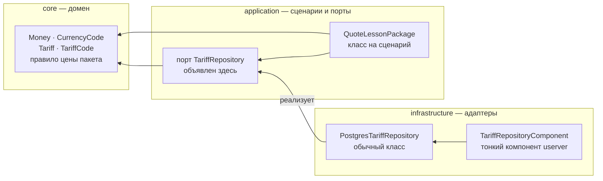

# Слои

**Зависимости направлены только внутрь: `core` не знает никого, `application`
знает `core`, `infrastructure` знает обоих.**

Стрелка — «знает о». Наружу не идёт ни одна.

## Что кому запрещено

| Слой | Не может включать |
| --- | --- |
| `core/` | `userver`, `pqxx`/`libpq`, `application/`, `infrastructure/` |
| `application/` | `userver`, `pqxx`/`libpq`, `infrastructure/` |
| `infrastructure/` | — внешний слой, ему можно всё |

Порт объявляет `application`, реализует `infrastructure`. Это и есть разворот
зависимости: сценарий формулирует, что ему нужно, а не подстраивается под то,
что умеет драйвер базы. Порты узкие — `TariffRepository` с одним вопросом, а не
`Repository` с двадцатью методами, потому что фейк узкого порта пишется в
четыре строки, а фейк широкого не пишется никогда.

## Чем это обеспечено

Правило проверяется двумя способами, и оба ломают сборку, а не портят настроение:

* `scripts/check_layers.py` разбирает директивы `#include` (комментарии и сырые
  строки вырезаются, эвристик по именам файлов нет) и печатает нарушение как
  `файл:строка`. Ненулевой код возврата. Отрицательный случай проверяется самой
  проверкой: `python3 scripts/check_layers.py --selftest`.
* `libs/pdr-core/CMakeLists.txt` в конце конфигурации читает зависимости цели
  `pdr_core` и падает с `FATAL_ERROR`, если там появился `userver`, `pqxx` или
  `PostgreSQL`. Прилинковать userver к домену не «не принято» — это не
  собирается.

Оба шага гоняются в `.github/workflows/architecture.yml`, там же `pdr_core` и
`pdr_application` собираются в окружении, где userver вообще нет.

## Почему так строго

На предыдущем проекте на этом же стеке репозиторий был объявлен как
`final : ComponentBase` — конкретный класс, сросшийся с userver. Следствие: ни
одного изолированного unit-теста бэкенда, сто процентов тестов гоняли реальный
бинарник и реальный Postgres, а значит, минуты вместо секунд и «проверим на
стенде» вместо «проверим сразу».

Здесь адаптер — обычный класс с обычным конструктором, а компонент userver
только создаёт его и отдаёт ссылку на порт. Сценарий подставляет фейк порта и
проверяется без базы, без докера и без сети.
