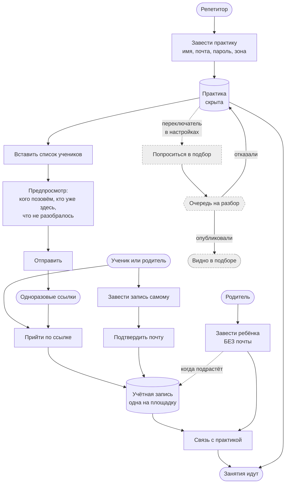

# Пути входа: как человек попадает в продукт

Мы конкурируем не с площадкой объявлений. Мы конкурируем со связкой «Профи.ру
плюс телеграм плюс календарь плюс бумажные методички плюс чужая созвонилка», и
побеждаем тем, что заменяем связку целиком, **сохранив существующие отношения**.

Отсюда главное требование ко входу, из которого выводится всё остальное:

> **Репетитор с двадцатью учениками должен завести практику и работать, ни разу
> не увидев подбор.**

## Развилки нет

Вопрос «зачем вы пришли» человек не обязан осмыслять. Он не знает, чем
«я веду учеников» отличается от «я ищу учеников» в нашей системе, и ответ его ни
к чему не обязывает — а неверный ответ уводит его в ветку, из которой он потом
выбирается. Развилка при регистрации запрещена правилом 1 из
[ADR-0016](../adr/0016-less-time-in-product-is-better.md): ни одного
обязательного поля сверх того, чем человек входит.

Поэтому вход один: **завёл практику, позвал учеников, работает.**



Пунктир и серое — то, чего в пути переноса практики нет. Подбор и публичный
профиль **выключены у всех по умолчанию** и включаются переключателем в
настройках, когда человеку это понадобилось.

## Два пути внутрь, одно состояние

| Путь | Кто так приходит | Что получается |
| --- | --- | --- |
| по приглашению | ученики переезжающего репетитора | учётная запись, почта уже подтверждена письмом |
| самостоятельно | пришёл через подбор | учётная запись, почту подтверждает ссылкой |

**Состояние на выходе одно и то же.** Двух видов учеников в системе нет: связи с
практиками — отдельная вещь, и их может быть сколько угодно, включая ноль.
Иначе через полгода половина сценариев начала бы спрашивать, какой это вид.

Почта по приглашению не подтверждается второй раз намеренно: письмо со ссылкой
дошло — значит адрес рабочий, и «подтвердите почту» человеку, который только что
открыл письмо, ничего не проверяет.

## Ребёнок без учётной записи

Семилетнему ученику не нужен почтовый ящик. Родитель заводит его как человека
практики — с датой рождения и опекой, — и входить ребёнку пока нечем. Это
**нормальное состояние, а не наполовину заведённое**.

Учётная запись добавляется потом, отдельным действием, и момент определяет
возраст, а не мы: с первого порога ученик двигает свои занятия сам
([permissions.md](permissions.md)), и вот тогда ему есть куда входить.

## Взрослый ученик: опекуна нет, и это норма

Языки — около трети всего репетиторства, а к ним добавляются вузовские курсы и
переподготовка. У такого ученика опекуна нет **вовсе**, и заводить его нечем и
незачем.

Заводится он обычным путём: сам (`RegisterOnMyOwn`) или по приглашению
репетитора (`AcceptInvitation`) — теми же сценариями, что и все остальные.
**Развилки «взрослый или ребёнок» на входе нет** ровно так же, как нет развилки
«школа или репетитор»: разницу делает названная дата рождения, а не вопрос в
анкете. Дата эта **заявительная**: паспорта продукт не просит, номера его не
хранит и подлинность не проверяет
([ADR-0020](../adr/0020-adult-student-is-the-main-case.md)).

Дальше он проходит весь путь сам — записывается, платит, пишет отзыв, смотрит
свой прогресс, — и опека не спрашивается ни в одном из этих мест. Это проверено
перебором по всему реестру действий в мире, где опеки не заведено ни разу
(`AdultStudentTest.EveryStudentActionWorksWithoutASingleGuardian`), и отдельно —
разбором самого кода (`scripts/check_adult_student.py`).

### Наблюдатель вместо опекуна

Доступ третьего лица взрослому нужен не реже, чем ребёнку: супруг смотрит
расписание, тренер — прогресс, работодатель оплачивает курс. Механизм тот же
самый — согласие на уровень, — и различается только **основание**:

| Основание | Кто выдаёт | Чем держится |
| --- | --- | --- |
| `guardianship` | опекун или сам ученик с порога | действующей опекой |
| `named_by_student` | **только сам ученик** | его словом |
| `pays_for_lessons` | **только сам ученик** | оплатой, и несёт только счета |

Третьей роли ни у кого из них нет: наблюдатель — это `Role::kGuardian` с другим
основанием доступа, и уровни, отзыв и журнал у него общие с родителем
семиклассника. Порядок выдачи и отзыва —
[runbooks/guardian-access.md](../runbooks/guardian-access.md).

**Плательщик содержания занятий не видит.** Оплата не открывает ни прогресса, ни
конспектов, ни записей: строку «плательщик с доступом к записям» не соберёт
домен и не примет схема. Если ученик хочет показать работодателю, как идут дела,
он открывает это сам — и в журнале это видно как его решение.

## Один человек — несколько репетиторов

Математику ведёт один репетитор, английский другой. Это обычное дело, и заложено
оно сейчас, потому что задним числом стоит переписывания модели.

* **человек один** — одна учётная запись на всю площадку
  ([ADR-0019](../adr/0019-one-account-many-practices.md)), и по одному
  идентификатору он появляется в нескольких практиках;
* **репетитор не видит НИЧЕГО о занятиях ученика у других** — ни факта, ни
  предмета, ни имени коллеги. Держит это построчная защита, а не аккуратность
  запросов ([tenancy.md](tenancy.md)); проверяется на живой базе случаем «один
  человек — две практики» в `scripts/check_isolation.py`;
* **прогресс, план и цель раздельны по предметам.** Общего числа «готовности
  вообще» не существует нигде: как только оно появилось бы, пришлось бы решать,
  чей предмет в нём главный, а верного ответа нет;
* **склейка — только в ленте ученика и опекуна** (`PDR-PRG-02`): там несколько
  предметов показываются рядом. Больше нигде.

Через границу практики при этом пересекает ровно одна вещь — отпечаток почты в
реестре учётных записей. Ни имени, ни адреса, ни того, чей он ученик: состав
колонок обеих внеарендаторских таблиц заперт списком в `scripts/check_rls.py`,
и «готовность вообще» туда не заводится молча.

## Антифрод: свободно входим, разбираем видимость

| Что | Где стоит | Почему там |
| --- | --- | --- |
| подтверждение почты | самостоятельная регистрация | адрес, которого нет, дальше не проходит |
| порог частоты (`PDR_SIGNUP_THROTTLE`) | самостоятельная регистрация | тысяча пустых записей ничего не стоит, а разбирать их придётся руками |
| разбор руками | **публикация профиля** | цена ошибки чужая, и решает её человек |

**Регистрация свободна, модерируется видимость.** Очередь на входе означала бы,
что репетитор с двадцатью учениками ждёт, пока его посмотрят, — и уходит к тем,
кто не заставляет ждать. Всё время разбора практика работает: занятия идут,
ученики приглашены, деньги считаются.

Кто ждёт разбора — `make practice-queue`. Это работа оператора и запрос под ролью
миграций: очередь общая поверх всех практик, а построчная защита такого вопроса
не пропускает — она и заведена, чтобы не пропускать.

## Уехать так же легко, как приехать

Переезжать к нам будут ровно настолько охотно, насколько легко уехать обратно.
Поэтому обе команды есть с первого дня:

```
make account-export TENANT=<uuid> OUT=account.json
make account-delete TENANT=<uuid>
```

Выгрузка отдаёт всё сразу и держит границу политикой, а не запросом
([openness.md](openness.md)). Удаление перечисляет таблицы поимённо, а не
каскадом: каскад молча уносит то, о чём никто не подумал, а забытая таблица
роняет скрипт вместо того, чтобы оставить хвост.

Учётные записи людей при удалении практики не трогаются: у ученика может быть
второй репетитор, и удаление практики по математике не должно отнимать у него
английский.

## Что проверяет машина

| Правило | Чем |
| --- | --- |
| путь переноса практики проходится целиком, и практика остаётся скрытой | `OnboardingTest.APracticeMovesInWithoutEverSeeingDiscovery` |
| повтор не шлёт второго письма тому же адресу | `OnboardingTest.ASecondSendWritesToNobodyTwice` |
| предпросмотр ничего не отправляет | `OnboardingTest.ThePreviewSendsNothing` |
| профиль не публикуется до разбора, практика при этом работает | `OnboardingTest.ThePracticeWorksWhileItWaitsForReview` |
| один человек — две практики, и репетиторы не видят друг друга | `OnboardingTest.ATutorLearnsNothingAboutTheOtherPractice`, `scripts/check_isolation.py` |
| ребёнок заводится без почты | `OnboardingTest.AChildIsEnrolledWithoutAnAccountAndGetsOneLater` |
| взрослый проходит весь путь без единого опекуна | `AdultStudentTest.EveryStudentActionWorksWithoutASingleGuardian`, `scripts/check_adult_student.py` |
| наблюдателя взрослый называет сам и сам отзывает | `AdultStudentTest.HeNamesAWatcherHimselfAndTakesItBack`, `...AWatcherIsNamedByTheOneWatched` |
| плательщик не видит ни аналитики, ни конспектов | `AdultStudentTest.ThePayerSeesTheBillAndNothingElse`, `scripts/check_isolation.py` |
| документов о возрасте продукт не просит | `scripts/check_adult_student.py` |
| в выгрузку попадает каждая таблица практики | `scripts/check_openness.py` |
| учебное число не пересекает границу практики | `scripts/check_rls.py` |

## Чего ещё нет

* **ручек нет вовсе** — как и всего слоя HTTP. Всё перечисленное сегодня
  вызывается сценарием, а не кнопкой;
* **письма никто не шлёт.** Сценарии возвращают секрет тому, кто их позвал;
  доставка — контекст `notifications`
  ([first-service.md](first-service.md));
* **подбора и публичного профиля не существует.** Контексты `matching` и
  `profile` рождаются в пятой фазе ([context-map.md](context-map.md)). Здесь
  заведён только переключатель: практика знает, видна она или нет, и по
  умолчанию не видна;
* **прогресса, плана и цели тоже нет** — контексты `progress` и `content` ещё не
  родились. Правило «раздельно по предметам» записано здесь и заперто проверкой
  состава внеарендаторских таблиц; инстанцировать его будет тот, кто заведёт
  первый учебный контекст.
