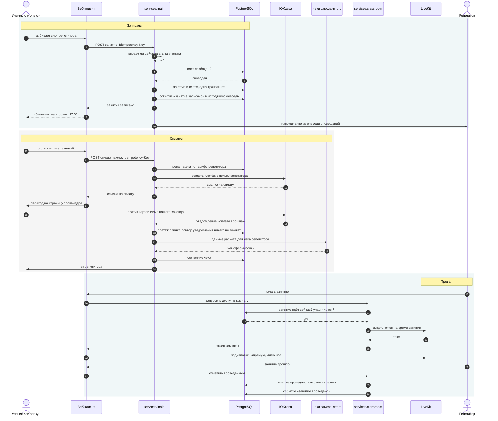

# Записался → оплатил → провёл

Центральный сценарий продукта. Он нарисован **до того, как написан**, и это
осознанно: в нём сходятся четыре контекста, две внешние системы и одна
обязанность по закону, а такое место дешевле разобрать на картинке, чем в
отладчике.

Слева направо — то, что видит человек; сверху вниз — время. Пунктирная стрелка
означает ответ, не начало нового шага.

## Три места, где сценарий ломается, и что там происходит

**Слот заняли раньше.** Домен отвечает отказом `slot_already_taken`, а не
исключением: «слот занят» — обычный ответ, а не авария
(`libs/pdr-scheduling/src/scheduling/application/book_lesson.cpp`). Человек
видит «Это время у репетитора уже занято. Выберите другое время или посмотрите
ближайшие свободные окна» — текст лежит в
`clients/shared/i18n/ru.json` и проверяется линтером речи
([voice.md](../product/voice.md)).

**Уведомление об оплате пришло дважды.** Провайдер повторяет уведомления, пока
не получит подтверждения, — это норма протокола, а не сбой. Повтор обязан
ничего не менять: обработка идемпотентна по ключу платежа. То же на записи:
`Idempotency-Key` на всех мутирующих запросах.

**Чек не сформировался.** Это **состояние, а не ошибка**
([ADR-0008](../adr/0008-tutor-is-the-seller.md)): оплата прошла, обязанность
репетитора осталась невыполненной. Продукт показывает состояние, повторяет
попытку фоновым заданием ([jobs.md](jobs.md)) и не теряет его. Единственная
внешняя зависимость с высоким риском и без альтернативы — она же
([openness.md](openness.md)).

## Что здесь уже написано, а что нарисовано

| Шаг | Состояние | Где |
| --- | --- | --- |
| Право действовать за ученика | есть | `libs/pdr-identity/contract/identity/contract.hpp` |
| Занятие в слоте, отказы «слот занят» и «время прошло» | есть | `libs/pdr-scheduling/src/scheduling/application/book_lesson.cpp` |
| Событие «занятие записано» | есть | `libs/pdr-events/include/events/scheduling/lesson_booked.hpp` |
| Событие в исходящую очередь оповещений | есть | `libs/pdr-notifications/src/notifications/application/deliver_domain_events.cpp` |
| Цена пакета по тарифу | есть | `libs/pdr-billing/src/billing/core/lesson_package.cpp` |
| Повтор фоновым заданием, ровно один раз | есть | `libs/pdr-jobs/src/jobs/core/job_settings.cpp` |
| Всё остальное: HTTP, платёж, чек, токен комнаты | нарисовано | сервисов в дереве нет |

**Половина сценария уже существует доменом, и ни одной строчки — контуром.**
Это ровно то состояние, ради которого фаза 0 и делается: правила и инварианты
написаны и проверены тестами, а процесс, который их выполняет, появится
последним и не принесёт с собой новых решений.
